# Bubbles

Social network where users can connect based on their differences.

## Description

At this point in the process this SPA has functionalities of a basic social network.
Users can register or log in.

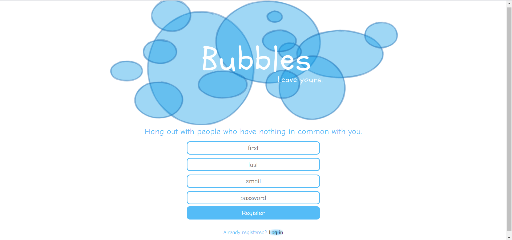

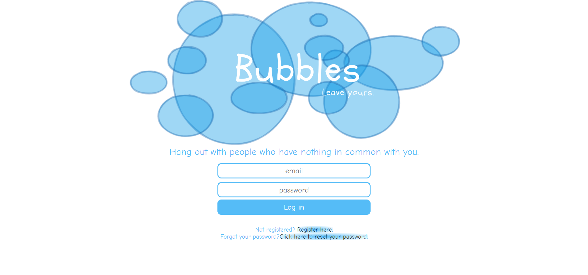

If an unfortunate event of forgetting the password occurs, users can reset it.

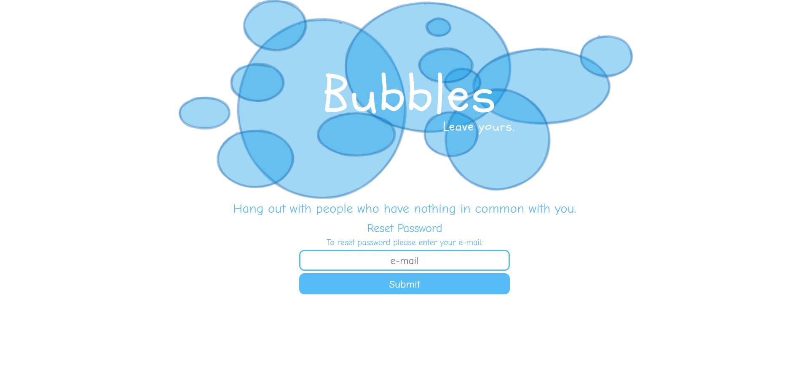

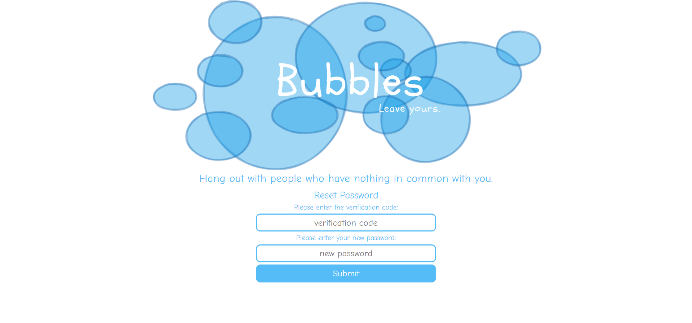

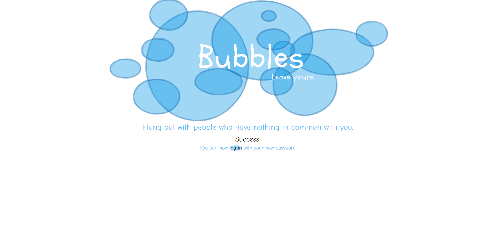

They can choose their profile picture and write something about themselves.

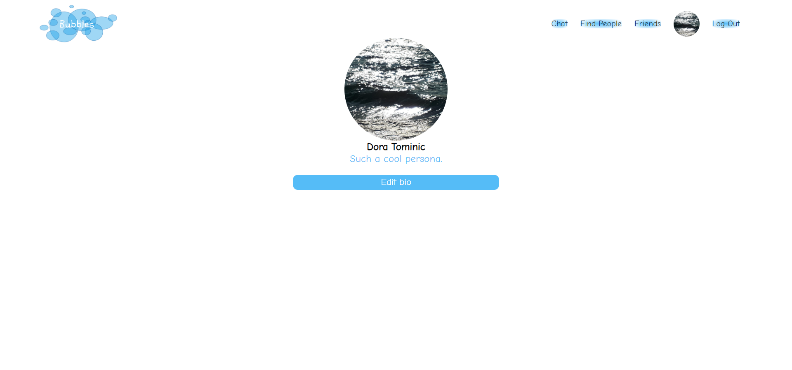

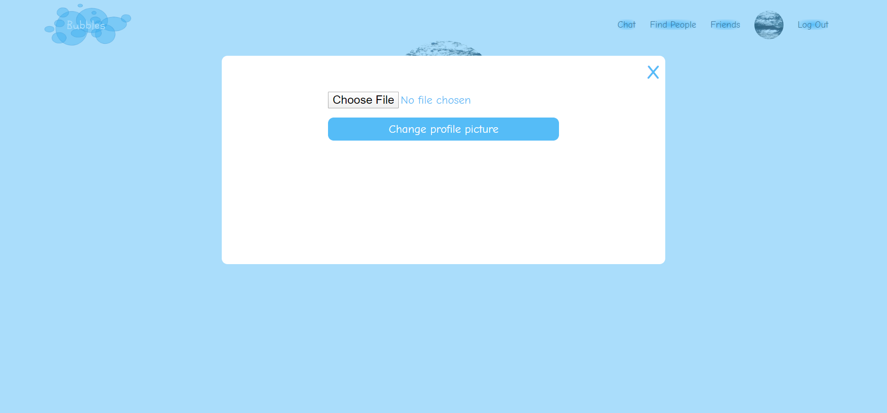

They can find other people's profiles, send and accept friend requests or end friendships.

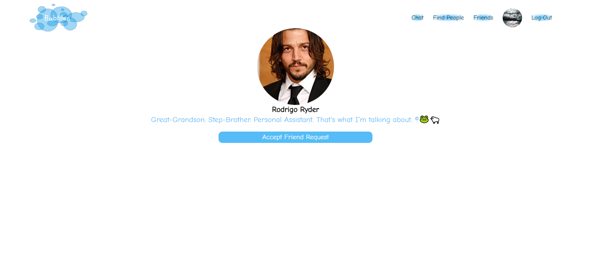

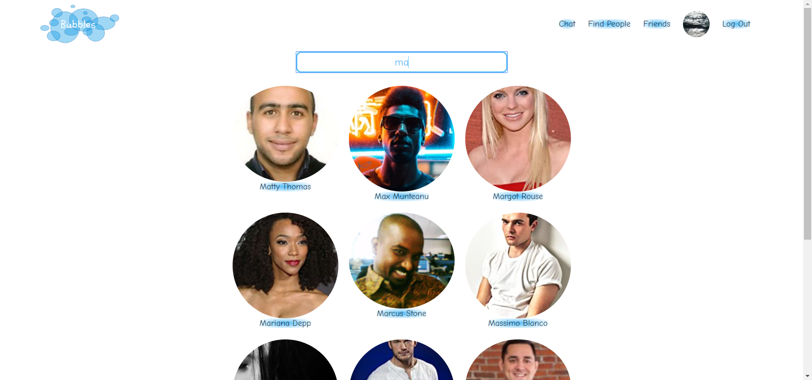

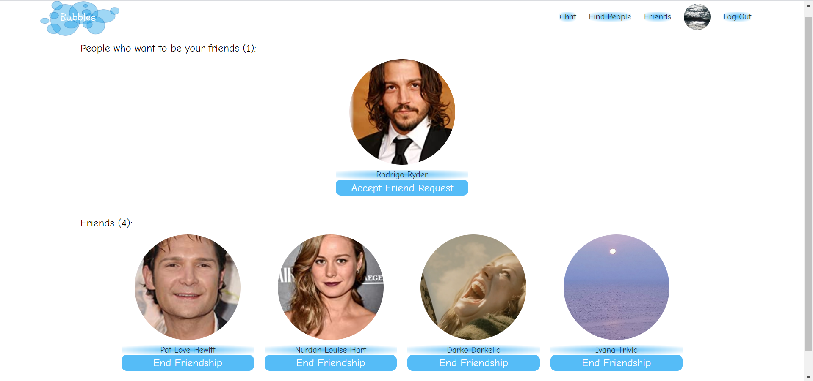

They can see who is online and participate in group chat or chat privately with friends.

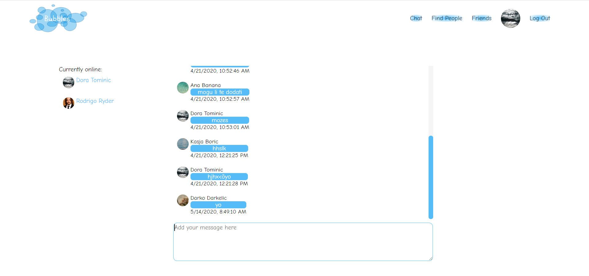

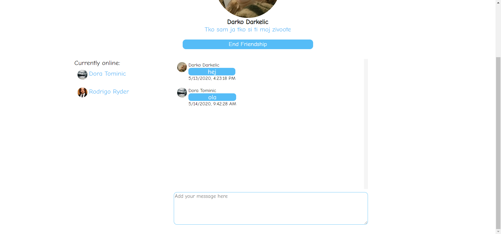

## Stack

-   Javascript
-   React
-   Redux
-   Node / Express
-   PostgreSQL
-   Socket.IO

## Explore on your own

[Bubbles on Heroku](https://burstyourbubble.herokuapp.com/)

## Future Features

-   Questionnaire and algorithm for connecting users with different backgrounds, experiences and interests
-   Account deletion
-   Wall posts
-   Friend request notifications
